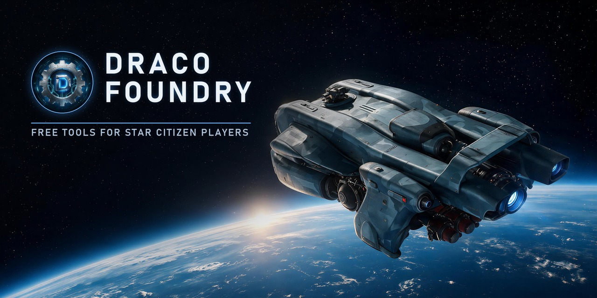

  

## Welcome to Draco Foundry

We build free, source-available tools for Star Citizen players. No subscriptions, no paid
features, and your data is never sold. Anything online is optional, and you can take your
data out or delete it any time.

## Projects

### [Open Hangar](https://github.com/Draco-Foundry/open-hangar)

_The free Star Citizen fleet manager._ Its browser extension reads your own RSI account
right in your browser, using the session you're already signed in with:

- See what your ships are worth at today's store prices, and what you paid for them
- Find melt candidates and check what your CCUs saved you
- Fleet stats, buy-backs, pledge history and what changed since your last scan
- Make a picture of your fleet (or just the stuff you're selling) to share
- Export to JSON or CSV, or as a Hangar Transfer Format file other fleet tools can read

Live on Chrome, Edge and Firefox.
Get it at **[openhangar.space](https://openhangar.space/extension)**.

### Open Hangar Website (Invite-Only Until November 10)

[openhangar.space](https://openhangar.space) is where new features land: Star Citizen news
and the Open Hangar Store today, and from November 10 your fleet manager, with My Hangar on
any device. Syncing is optional and comes with extension 0.3.0 on the same day: connect a
free account and the extension syncs after every scan, or skip it and your hangar stays in
your browser. You can disconnect any time.

Accounts are an invite-only beta until then, with invites on our
[Discord](https://discord.gg/FF8Wm5HdnV). Sign-ups open to everyone on November 10.

## Get Involved

- **Got an idea?** Post it on the [Ideas Board](https://github.com/Draco-Foundry/open-hangar/discussions/categories/ideas) and upvote the ones you want
- **Found a bug?** [Open an Issue](https://github.com/Draco-Foundry/open-hangar/issues/new/choose)
- **Just want to chat?** Come hang out on [Discord](https://discord.gg/FF8Wm5HdnV)
- **Want to chip in?** [Ko-fi](https://ko-fi.com/dracofoundry) or [Patreon](https://www.patreon.com/DracoFoundry), totally optional, everything stays free
- **Want to help build?** Pull requests are welcome, start with the [Contributing Guide](https://github.com/Draco-Foundry/open-hangar/blob/main/CONTRIBUTING.md)

---

Draco Foundry, LLC. Not affiliated with Cloud Imperium Games. Star Citizen and all ships shown are © Cloud Imperium Rights LLC.
